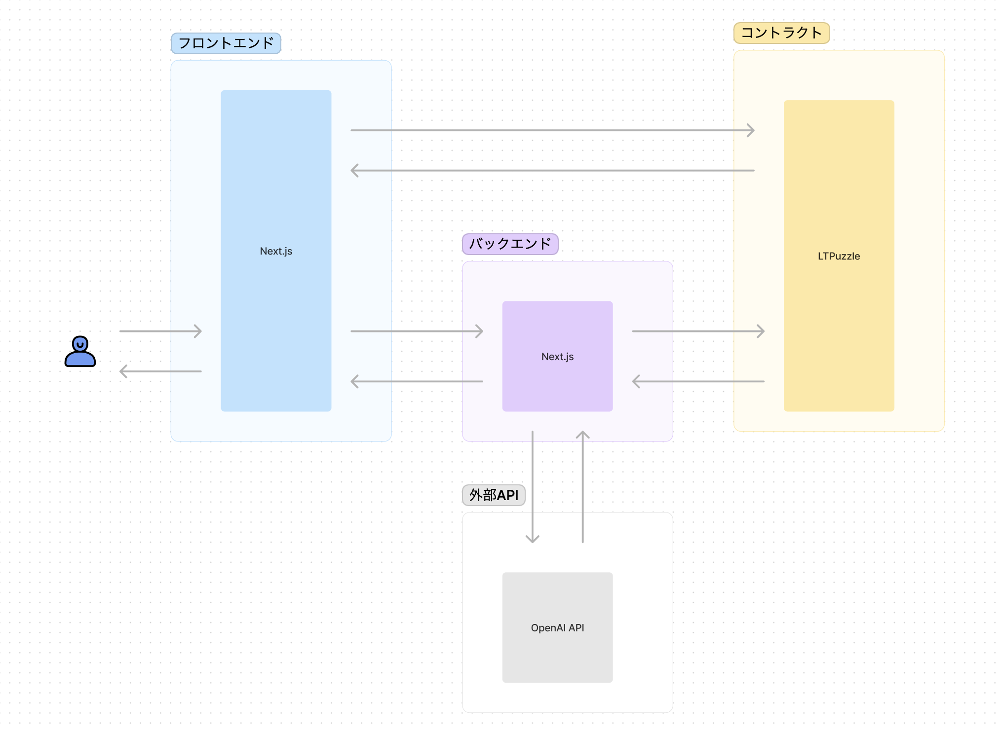

# RelationAl

### 製品概要
RelationAlは、水平思考ゲームをAIが生成し、出題するプラットフォームです。ユーザーは "はい"、"いいえ" の形式で質問をAIに投げ、謎を解き明かします。正解した問題はNFTとしてミントされ、これらの生成された問題はonchain上に永続的に保存されます。その結果、ユーザーが遊んでいくうちに、水平思考ゲームの問題集が自動的に作成される仕組みとなっています。

製品ページ：https://relational.vercel.app/

### 解決できる問題
既存の水平思考ゲームでは問題の多様性や再利用性に限界がありました。RelationAlはこれを解消し、AIによって生成される無限の問題のバリエーションと、それらの問題をNFTとしてミントし、onchain上に保存することで、再利用可能な問題集の作成を可能にします。

### 直面した課題
AIを制御することが最大の挑戦でした。特に、複雑で独創的な問題を生成しつつ、それらが理解可能で適切な解答が可能な問題であることを保証することは難しかったです。

### テックスタック
・Front End：Next.js, TailwindCSS

・Back End：Solidity, NFT(ERC721)

・API： Open AI API

・Hosting：Vercel

### どのように開発を進めたか
我々はまず、GPTモデルを使用して問題を生成するAIのプロトタイプを開発しました。その後、これらの問題をNFTとしてミントし、onchain上に保存する機能をERC721を使用して実装しました。最終的には、これらの機能をNext.jsとTypeScriptを使用して一つのウェブアプリケーションに統合しました。

### 学んだこと
このプロジェクトを通じて、AIの潜在能力とその制御の難しさを深く理解することができました。また、ブロックチェーンとNFTの持つ可能性とそれらをうまく活用する方法についても学びました。

### 展望
次のステップでは、他のNFTのメタデータを元に問題を生成する機能を開発する予定です。これにより、ユーザーが保有するNFTコレクションを元に独自の問題集を作成できるようになることを期待しています。また、より多様な問題を生成できるよう、AIの改善と拡張も続けていきます。

# ディレクトリ構成

- `packages/interface` -> フロントエンド系
- `packages/interface/src/pages/api` -> バックエンド系
- `packages/contracts` -> コントラクト系

# 開発環境

- フロントエンド
  - Next.js
  - Tailwind CSS
  - TypeScript
- バックエンド
  - Next.js (API)
  - TypeScript
- コントラクト
  - hardhat
  - Solidity
  - TypeScript

